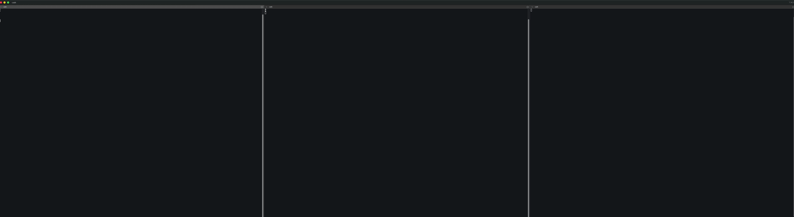
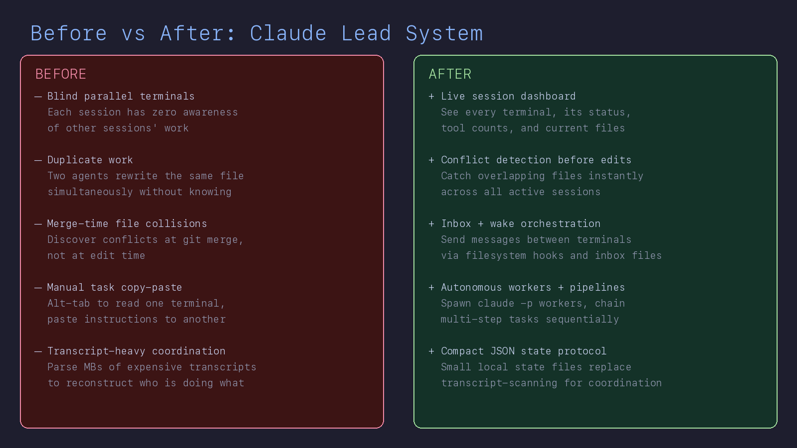

<div align="center">

# Claude Lead System

**Multi-agent Claude Code orchestration. Zero API tokens. One command.**

[](https://opensource.org/licenses/MIT)
[](https://github.com/DrewDawson2027/claude-lead-system/actions/workflows/ci.yml)
[](https://github.com/DrewDawson2027/claude-lead-system)
[](https://nodejs.org)
[](https://claude.ai/code)

</div>

---

> **Type `/lead` in any Claude Code session.**
> It instantly becomes a project lead that sees every other Claude terminal, knows what they're doing, and can message them, wake them, spawn new workers, detect file conflicts, and run multi-step pipelines — **using zero API tokens for coordination.**

---

## Why This Exists

When you run multiple Claude Code terminals in parallel, they're blind to each other. They step on the same files. They duplicate work. You spend your own tokens babysitting them.

`claude-lead-system` fixes this by wiring every terminal together through shell hooks and a lightweight filesystem protocol — **completely outside the context window**.

```
Terminal A (lead)          Terminal B (coding)       Terminal C (testing)
      │                          │                          │
      ▼                          ▼                          ▼
┌─────────────────────────────────────────────────────────────────────┐
│                     Shell Hooks (0 API tokens)                      │
│  PostToolUse  → terminal-heartbeat.sh  → enriches session JSON     │
│  PreToolUse   → check-inbox.sh         → delivers messages          │
│  SessionStart → session-register.sh    → registers new sessions     │
│  SessionEnd   → session-end.sh         → marks sessions closed      │
└─────────────────────────────────────────────────────────────────────┘
      │                          │                          │
      ▼                          ▼                          ▼
┌─────────────────────────────────────────────────────────────────────┐
│                      ~/.claude/terminals/                           │
│  session-*.json   → live state: tool counts, files, recent ops     │
│  activity.jsonl   → universal append-only activity log             │
│  inbox/           → per-session message queues                      │
│  results/         → autonomous worker output files                  │
└─────────────────────────────────────────────────────────────────────┘
      │
      ▼
┌─────────────────────────────────────────────────────────────────────┐
│               MCP Coordinator (optional — enhances)                 │
│  coord_spawn_worker     → autonomous workers via claude -p          │
│  coord_wake_session     → AppleScript / inbox injection             │
│  coord_detect_conflicts → file overlap detection                    │
│  coord_run_pipeline     → multi-step sequential task chains         │
└─────────────────────────────────────────────────────────────────────┘
```

---

## What `/lead` Can Do

| Command | What happens |
|---|---|
| *(boot)* | Scans all sessions, shows live dashboard |
| `tell [session] to [task]` | Sends a message to an active terminal |
| `wake [session] with [message]` | Wakes an idle terminal (direct wake sends Enter only by default; opt-in message typing via `allow_unsafe_terminal_message=true`) |
| `run [task] in [dir]` | Spawns an autonomous `claude -p` worker |
| `pipeline: task1, task2, task3 in [dir]` | Runs a multi-step sequential pipeline |
| `conflicts` | Cross-references `files_touched` arrays across all sessions |
| `spawn terminal in [dir]` | Opens a new interactive Claude Code terminal |
| `kill worker [id]` | Terminates a running worker |
| `health check` | Validates all hooks, deps, and settings |

---

## 2-Minute Demo

```bash
# 1) Install
curl -fsSL https://raw.githubusercontent.com/DrewDawson2027/claude-lead-system/main/install.sh | bash

# 2) Open two Claude Code terminals in the same project
# 3) In terminal A, run /lead
# 4) In terminal A, send:
#    tell [session] to write tests for src/auth.ts
# 5) In terminal A, run:
#    conflicts
```

Expected:
- Session dashboard appears with live `W/E/B/R` counters
- Message is delivered through inbox hook
- Conflict checker reports overlap when both sessions touch same file

---

## Demo Assets





- Demo recording guide: [assets/demo/README.md](assets/demo/README.md)
- Narration script: [assets/demo/DEMO_SCRIPT.md](assets/demo/DEMO_SCRIPT.md)
- Benchmark source: [bench/coord-benchmark.mjs](bench/coord-benchmark.mjs)
- Latest benchmark output: [bench/latest-results.json](bench/latest-results.json)

---

## Benchmarks (Before/After)

`claude-lead-system` is optimized to read compact session state instead of scanning large transcripts.

| Metric | Transcript Scan | Session JSON Read | Improvement |
|---|---:|---:|---:|
| Average latency | 3.944 ms | 0.019 ms | **207.58x faster** |
| P50 latency | 3.485 ms | 0.015 ms | **232.33x faster** |
| P95 latency | 5.826 ms | 0.022 ms | **264.82x faster** |
| Data size | 7,650,000 bytes | 1,357 bytes | **5,637x smaller** |

Measured by: `node bench/coord-benchmark.mjs` on `2026-02-19`.

---

## Before/After Outcomes

| Scenario | Before | After |
|---|---|---|
| Multi-session awareness | Manual tab hunting | `/lead` dashboard with active/stale sessions |
| File conflict detection | Merge-time surprise conflicts | Pre-edit conflict detection via `files_touched` |
| Task dispatch | Manual copy/paste across terminals | `tell`, `wake`, `assign`, `spawn_worker` |
| Long-running execution | Idle/forgotten terminal tasks | `coord_spawn_worker` + `coord_get_result` tracking |
| Sequential workflows | Manual step orchestration | `coord_run_pipeline` statusable pipeline execution |

---

## Platform Support

| Platform | Terminal Spawning | Session Waking | Messaging |
|---|---|---|---|
| **macOS — iTerm2** | Split panes + tabs | AppleScript by TTY | Inbox hooks |
| **macOS — Terminal.app** | New windows | AppleScript by title | Inbox hooks |
| **Windows — Windows Terminal** | Split panes + tabs (`wt`) | AppActivate + SendKeys (Enter-only by default), inbox fallback | Inbox hooks |
| **Windows — PowerShell / cmd** | New windows | AppActivate + SendKeys (Enter-only by default), inbox fallback | Inbox hooks |
| **Linux — gnome-terminal / konsole / kitty** | New windows / tabs | Direct safe TTY write (Enter-only by default), inbox fallback | Inbox hooks |
| **Cursor / VS Code** | Background `claude -p` workers | Inbox fallback | Inbox hooks |

Inbox messaging via hooks is **universal** — it works on every platform regardless of terminal emulator.

---

## Reliability Matrix

| Capability | Test Coverage |
|---|---|
| Hook shell syntax | CI (`bash -n hooks/*.sh`) |
| Python hook validity | CI (`py_compile` + `ruff` in workflow) |
| Coordinator syntax | CI (`node --check`) |
| Coordinator validation rules | CI (`npm run test:unit`) |
| Worker lifecycle (spawn/result/kill) | CI (`npm run test:e2e`) |
| Pipeline lifecycle (run/status/completion) | CI (`npm run test:e2e`) |
| Platform launch-path logic | CI matrix (`ubuntu`, `macos`, `windows`) |
| Hook behavior (session + heartbeat) | CI smoke test (`tests/hooks-smoke.sh`) |

---

## Compatibility Guarantees

- Node.js: **18.x, 20.x**
- Python: **3.10+**
- OS: **macOS, Linux, Windows** (with inbox fallback where native terminal wake/injection is unavailable)
- Release gating + versioned matrix: [docs/RELEASE_HARDENING.md](docs/RELEASE_HARDENING.md)

---

## Installation

### One-line install (macOS / Linux)

```bash
curl -fsSL https://raw.githubusercontent.com/DrewDawson2027/claude-lead-system/main/install.sh | bash
```

### Manual install

```bash
# 1. Clone
git clone https://github.com/DrewDawson2027/claude-lead-system.git
cd claude-lead-system

# 2. Copy hooks, commands, and MCP coordinator
cp -r hooks/ ~/.claude/hooks/
cp -r commands/ ~/.claude/commands/
cp -r mcp-coordinator/ ~/.claude/mcp-coordinator/
chmod +x ~/.claude/hooks/*.sh

# 3. Install MCP coordinator dependencies
cd ~/.claude/mcp-coordinator && npm install

# 4. Add hooks to your settings
# Option A (recommended): run install.sh (auto-expands __HOME__ in coordinator path)
# Option B (manual):
sed "s|__HOME__|$HOME|g" settings/settings.local.json > ~/.claude/settings.local.json
# or merge the hooks + mcpServers.coordinator blocks into your existing file

# 5. Verify everything is working
bash ~/.claude/hooks/health-check.sh

# 6. Done — type /lead in any Claude Code session
```

---

## How It Works

### Hooks run outside the context window

Every Claude Code tool call fires shell hooks. These hooks maintain a live state file per session — writing `tool_counts`, `files_touched`, and `recent_ops` to a small JSON blob on every tool invocation. **This costs zero tokens.** The lead reads a few KB of JSON instead of parsing MB of transcripts.

### Enriched session files

```json
{
  "session": "a1b2c3d4",
  "status": "active",
  "project": "my-app",
  "branch": "main",
  "cwd": "/Users/you/my-app",
  "tty": "/dev/ttys003",
  "schema_version": 2,
  "tool_counts": { "Write": 12, "Edit": 8, "Bash": 23, "Read": 5 },
  "files_touched": ["src/auth.ts", "src/db.ts", "tests/auth.test.ts"],
  "recent_ops": [
    { "tool": "Edit", "file": "src/auth.ts", "ts": "2026-02-19T14:32:01Z" }
  ]
}
```

### Rate-limited heartbeat

The heartbeat has a 5-second cooldown per session. Between full beats, only the activity log is appended (cheap). Stale detection runs max once per 60 seconds.

### MCP is optional

The filesystem protocol (session JSONs, inbox files, activity log) works without the MCP coordinator. The coordinator adds `spawn_worker`, `wake_session`, `run_pipeline`, and `detect_conflicts` — but the core messaging and awareness layer works the moment you install the hooks.

---

## Components

| File | Role |
|---|---|
| `hooks/terminal-heartbeat.sh` | Rate-limited PostToolUse hook — enriches session JSON |
| `hooks/session-register.sh` | SessionStart hook — registers sessions with TTY, branch, cwd |
| `hooks/check-inbox.sh` | PreToolUse hook — surfaces messages from lead/other terminals |
| `hooks/session-end.sh` | SessionEnd hook — marks closed, preserves final metadata |
| `hooks/health-check.sh` | Manual validator — checks all hooks, deps, and settings |
| `hooks/token-guard.py` | PreToolUse guard — enforces agent spawn limits (max 3/session) |
| `hooks/read-efficiency-guard.py` | PostToolUse advisor — warns about sequential read patterns |
| `commands/lead.md` | The `/lead` slash command prompt |
| `mcp-coordinator/index.js` | MCP server — spawn workers, wake sessions, run pipelines |
| `settings/settings.local.json` | Reference settings file with all hooks wired |

---

## Docs

- [Architecture](docs/ARCHITECTURE.md)
- [Security](docs/SECURITY.md)
- [Release Hardening](docs/RELEASE_HARDENING.md)

## Security Model

- Trust boundary: this system is designed for a single local user account and local machine workflows.
- Protected by default: coordinator state directories/files are owner-restricted, message payloads are size-capped, and inbox reads are bounded.
- Out of scope: hostile local root/admin users, compromised OS, and arbitrary shell commands executed by trusted operators.
- Fail-safe behavior: `hooks/token-guard.py` is fail-closed by default; set `TOKEN_GUARD_FAIL_OPEN=1` only for troubleshooting.

---

## Key Design Decisions

**Zero API tokens for coordination.** Hooks are shell scripts. They run outside the Claude context window. Coordination is free.

**Enriched session files eliminate transcript parsing.** Reading 3KB of JSON per session is orders of magnitude cheaper than parsing a transcript to infer state.

**Rate-limited heartbeat.** 5-second cooldown prevents IO storms on busy sessions.

**Schema versioned.** `schema_version` in session files enables non-breaking migrations.

**MCP is optional.** The file-based layer works standalone. MCP adds power-user features on top.

**Cross-platform wake strategy.** macOS uses AppleScript, Linux attempts direct safe TTY wake, Windows uses AppActivate best-effort, and all platforms keep inbox fallback. Direct wake defaults to Enter-only safety mode; typed message injection is explicit opt-in.

---

## Requirements

- [Claude Code](https://claude.ai/code) installed and authenticated
- `jq` (`brew install jq` / `apt install jq` / `choco install jq`)
- Node.js ≥ 18 (for MCP coordinator)
- `bash` (hooks)
- `python3` (optional guards)

---

## Quality Gates

- CI validates shell, Python, and JavaScript syntax
- CI runs coordinator argument-validation tests
- CI enforces performance SLO thresholds via `tests/perf-gate.mjs`
- CI runs hook smoke tests (`session-register` + `terminal-heartbeat`) in isolated HOME
- `health-check.sh` validates install health on your machine
- Release supply-chain workflow publishes SBOM, provenance attestation, and keyless cosign signatures

---

## Contributing

See [CONTRIBUTING.md](CONTRIBUTING.md). PRs welcome — especially for:
- `tmux` / `zellij` split pane support
- Tests for hooks

---

## License

MIT — see [LICENSE](LICENSE).
