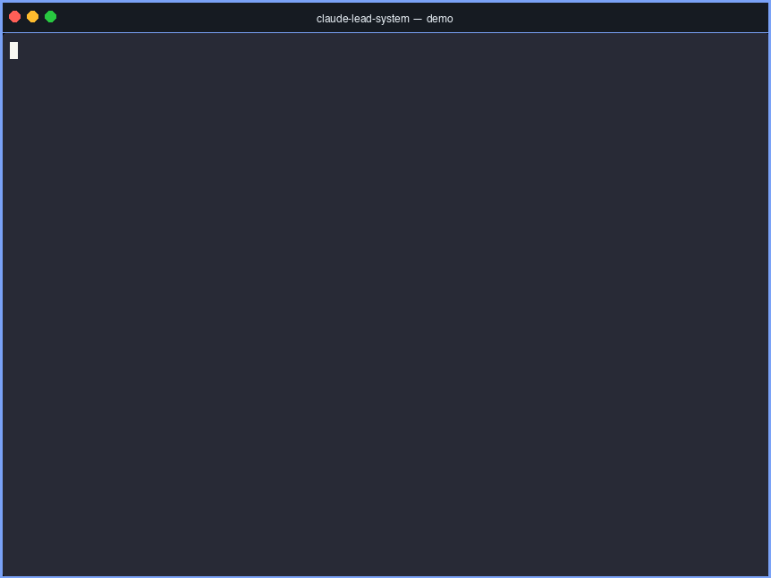

<div align="center">


</div>

<div align="center">

[](https://www.npmjs.com/package/claude-lead-system)
[](https://github.com/DrewDawson2027/claude-lead-system/actions)
[](https://github.com/DrewDawson2027/claude-lead-system/actions)
[](https://opensource.org/licenses/MIT)
[](docs/COMPATIBILITY_MATRIX.md)

<br />

[](https://git.io/typing-svg)

<br />

[**Install**](#install) · [**How It Works**](#what-it-does) · [**MCP Tools**](#mcp-tools) · [**Docs**](#docs)

</div>

---

## The Problem

Two Claude terminals. Same file. Neither knows.

```
Terminal A  →  editing src/auth/login.ts
Terminal B  →  editing src/auth/login.ts   ← collision incoming
```

One silently overwrites the other. You find out when the build breaks — or worse, when a bug ships.

## The Solution

```
claude > /lead

→ ⚠  CONFLICT: src/auth/login.ts — frontend ↔ backend
→  Both terminals notified. Collision blocked. 0 tokens used.
```

The Lead System intercepts the collision **before** it happens. It runs entirely on the filesystem — no API round-trips, no extra token cost, no context window pollution.

---

## Demo

<div align="center">



</div>

---

## Install

```bash
npm install -g claude-lead-system
```

Open Claude Code. Type `/lead`. Done — the coordinator wires itself into your Claude settings on first run.

```bash
claude
> /lead
```

> **Prefer git?** `git clone https://github.com/DrewDawson2027/claude-lead-system.git && bash install.sh`

---

## What It Does

| Capability                   | What happens                                                                                                                        |
| ---------------------------- | ----------------------------------------------------------------------------------------------------------------------------------- |
| **Conflict detection**       | Flags files touched by two sessions simultaneously — before either overwrites the other. Both sessions get notified.                |
| **Cross-terminal messaging** | Send instructions to any named terminal directly from the lead session. Delivered via the local filesystem inbox — zero API tokens. |
| **Persistent task board**    | Tasks survive terminal restarts. Close a session, reopen it — the board is still there.                                             |
| **Live dashboard**           | Every active terminal: branch, files touched, last-active time. Refreshes on demand.                                                |
| **Plan approval protocol**   | Workers pause before executing plans. Lead reviews and approves. You stay in control of what actually runs.                         |
| **Budget governance**        | Cap how many turns a worker can take before it stops. Prevents runaway sessions.                                                    |
| **Session resumption**       | Re-enter a prior worker conversation by session ID. Preserves context across restarts.                                              |

---

## Lead-Exclusive Capabilities

These features are not available in vanilla Claude Code multi-session workflows:

| #   | Capability                   | Detail                                                   |
| --- | ---------------------------- | -------------------------------------------------------- |
| 1   | Real-time conflict detection | File-level, cross-session, pre-collision                 |
| 2   | Zero-token coordination      | All coordination uses local filesystem, not the API      |
| 3   | Named terminal messaging     | Send to `frontend`, `backend`, `reviewer` — by name      |
| 4   | Persistent task board        | Survives context-window resets and terminal restarts     |
| 5   | Plan approval gate           | Workers wait for explicit lead sign-off before executing |
| 6   | Turn budget caps             | Hard limits on worker session length                     |
| 7   | Session resumption by ID     | Re-enter prior worker conversation                       |
| 8   | Broadcast to all terminals   | One message → all active workers simultaneously          |
| 9   | Live activity log            | Append-only audit trail of all cross-terminal activity   |

---

## MCP Tools

48 coordinator tools available from any Claude session after install. Key tools:

```bash
coord_detect_conflicts    # detect files touched by two sessions simultaneously
coord_wake_session        # send a message to any terminal by session ID
coord_boot_snapshot       # live dashboard — all active terminals at a glance
coord_create_task         # add a persistent task to the shared board
coord_broadcast           # send one message to all active terminals at once
coord_spawn_worker        # launch a background worker with a task prompt
coord_spawn_workers       # launch multiple workers in parallel
coord_get_result          # retrieve the latest output from a worker
coord_check_inbox         # check a session's inbox for pending messages
coord_list_sessions       # list all active sessions with metadata
```

Full reference → [docs/MCP_TOOL_REFERENCE.md](docs/MCP_TOOL_REFERENCE.md)

---

## By the Numbers

<div align="center">

| Metric                      |      Value      |
| :-------------------------- | :-------------: |
| Tests                       | **594 passing** |
| Coverage                    |    **85%+**     |
| MCP tools                   |     **48**      |
| Library modules             |     **24**      |
| macOS capabilities verified |    **8 / 8**    |
| Linux capabilities verified |    **8 / 8**    |
| Coordination API tokens     |      **0**      |

</div>

---

## Platform Support

| Platform | Status      | Details                                                               |
| -------- | ----------- | --------------------------------------------------------------------- |
| macOS    | ✅ Verified | iTerm2, Terminal.app — all 8 capabilities                             |
| Linux    | ✅ Verified | gnome-terminal, konsole, kitty, alacritty, xterm — all 8 capabilities |
| Windows  | ⚪ Canary   | Windows Terminal / PowerShell — CI canary, not yet verified           |

Full matrix → [docs/COMPATIBILITY_MATRIX.md](docs/COMPATIBILITY_MATRIX.md)

---

## Requirements

- [Claude Code](https://claude.ai/code) installed and authenticated
- Node.js ≥ 18
- `jq` — `brew install jq` / `apt install jq`
- `bash`, `python3`

---

## The Story

> Built entirely through Claude Code by a Philosophy, Politics & Economics student at USC — no prior programming background.
>
> 48 tools. 594 tests. A complete local coordination layer for multi-terminal Claude workflows.
>
> Every line written in natural language, verified in CI.

---

## Docs

| Document                                             | Description                                     |
| ---------------------------------------------------- | ----------------------------------------------- |
| [Getting Started](docs/GETTING_STARTED.md)           | First 10 minutes walkthrough                    |
| [MCP Tool Reference](docs/MCP_TOOL_REFERENCE.md)     | All 48 coordinator tools                        |
| [Architecture](docs/ARCHITECTURE.md)                 | System design and coordination layers           |
| [Compatibility Matrix](docs/COMPATIBILITY_MATRIX.md) | Evidence-backed platform support                |
| [Known Limitations](docs/KNOWN_LIMITATIONS.md)       | What doesn't work yet and why                   |
| [Security](docs/SECURITY.md)                         | Threat model, filesystem hardening, token guard |
| [Troubleshooting](docs/TROUBLESHOOTING.md)           | Common failure modes and fixes                  |
| [Contributing](CONTRIBUTING.md)                      | Setup instructions and contribution areas       |

<details>
<summary>Advanced install — signed release verification</summary>
<br />

For production or verified release installs:

```bash
bash install.sh --version <version>
```

`--ref` installs are dev-only and require `--allow-unsigned-release`. See [docs/RELEASE_HARDENING.md](docs/RELEASE_HARDENING.md) for full verification steps.

</details>

---

<div align="center">


MIT License · Made by [@DrewDawson2027](https://github.com/DrewDawson2027)

</div>
