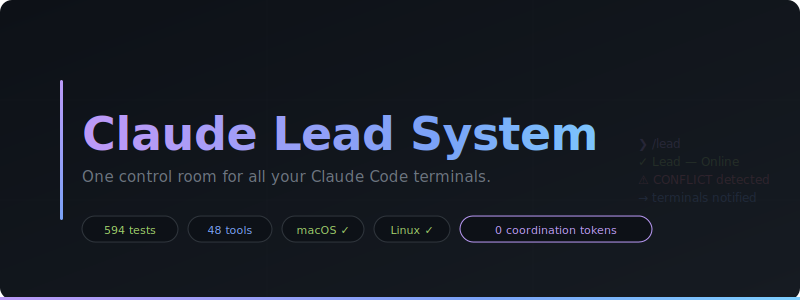
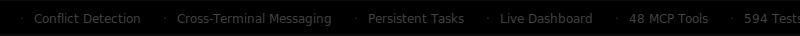
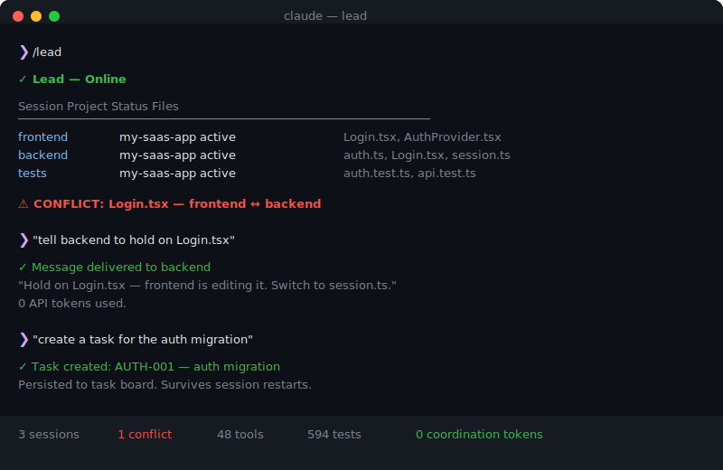

<p align="center">
  <picture>
    
  </picture>
</p>

<h1 align="center">The Lead System</h1>

<p align="center">
  <strong>One control room for all your AI coding terminals.</strong>
</p>

<p align="center">
  <a href="https://www.npmjs.com/package/claude-lead-system">
    
  </a>
  <a href="https://github.com/DrewDawson2027/lead-system/actions">
    
  </a>
  <a href="https://github.com/DrewDawson2027/lead-system/actions">
    
  </a>
  <a href="https://opensource.org/licenses/MIT">
    
  </a>
</p>

<div align="center">
  
</div>

---

Two Claude terminals. Same file. Neither knows.

```
Terminal A → editing src/auth/login.ts
Terminal B → editing src/auth/login.ts  ← about to collide
```

One overwrites the other. You find out when the build breaks.

```
> /lead
→ ⚠ CONFLICT: login.ts — frontend ↔ backend
→ Both terminals notified. Collision blocked. 0 tokens used.
```

---

## Install 📦

```bash
npm install -g claude-lead-system
```

Open Claude Code. Type `/lead`. That's it.

```bash
claude
> /lead
```

The coordinator wires itself into your Claude settings automatically on first run — no special launcher, no extra config file to edit.

> **Prefer git?** `git clone https://github.com/DrewDawson2027/claude-lead-system.git && bash install.sh`

---

## What It Does 🎯

If you've ever had two Claude sessions silently clobber each other's work and only found out when the build exploded — this is for you.

**Conflict detection** — Flags when two terminals are about to edit the same file, before the collision. Both sessions get notified. You get to intervene. The build stays green.

**Cross-terminal messaging** — Tell any running terminal what to do, by name, from the lead session. "Backend, hold on `auth.ts` — frontend owns it right now." Message delivered. Zero API tokens spent — coordination runs on the filesystem, not through Claude's context window.

**Persistent task board** — Create tasks that survive terminal restarts. Close a session, reopen it, the board is still there. Tasks don't vanish because a context window did.

**Live dashboard** — Every active terminal, what branch it's on, what files it's touching, when it was last active. All of it, the moment you type `/lead`.

**Plan approval protocol** — Workers pause before executing plans. Lead reviews and approves. You stay in control of what actually runs.

---

## Demo 🖥️

<div align="center">
  
</div>

---

## MCP Tools 🔧

Available from any Claude session after install:

```
coord_detect_conflicts    # flag when two terminals are about to edit the same file
coord_send_message        # send instructions to any terminal by name or session ID
coord_boot_snapshot       # live dashboard — all active terminals at a glance
coord_create_task         # create a persistent task on the shared board
coord_broadcast           # send one message to all active terminals simultaneously
```

48 tools total. Full reference → [docs/MCP_TOOLS.md](docs/MCP_TOOLS.md)

---

## By the Numbers 📊

```
594 tests  ·  85% coverage  ·  48 MCP tools  ·  24 lib modules
macOS verified (8/8)  ·  Linux verified (8/8)  ·  0 coordination tokens
```

---

## The Story ✍️

I'm a Philosophy, Politics & Economics student at USC — no prior programming background. I built this entire system through Claude Code. 48 tools. 594 tests. A complete local coordination layer for multi-terminal Claude workflows. Every line of it written in natural language.

---

## Requirements

- [Claude Code](https://claude.ai/code) installed and authenticated
- Node.js ≥ 18
- `jq` — `brew install jq` / `apt install jq`
- `bash`, `python3`

---

## Docs 📄

[Getting Started](docs/GETTING_STARTED.md) · [MCP Tool Reference](docs/MCP_TOOLS.md) · [Troubleshooting](docs/TROUBLESHOOTING.md) · [Security](docs/SECURITY.md) · [Contributing](CONTRIBUTING.md)

---

<p align="center">
  MIT License · Made by <a href="https://github.com/DrewDawson2027">@DrewDawson2027</a>
</p>
