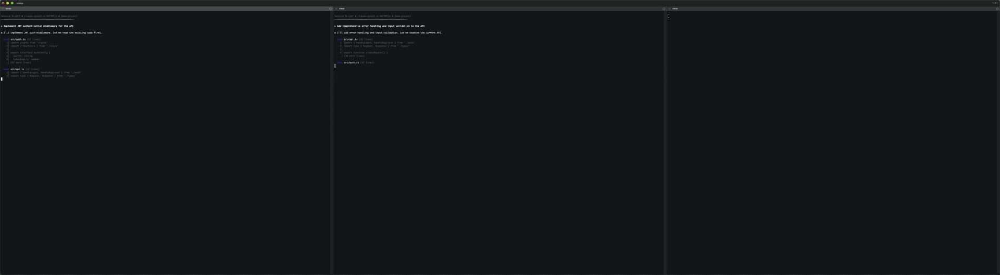

<div align="center">

# Claude Lead System

### Zero-token multi-agent orchestration for Claude Code

**Agent Teams costs 3-4x more tokens. This does the same thing — plus 13 features it can't do — for free.**

[](https://opensource.org/licenses/MIT)
[](https://github.com/DrewDawson2027/claude-lead-system/actions/workflows/ci.yml)
[](https://github.com/DrewDawson2027/claude-lead-system/actions/workflows/badges-publish.yml)
[](https://github.com/DrewDawson2027/claude-lead-system/blob/main/reports/token-system-regression-latest.json)
[](https://github.com/DrewDawson2027/claude-lead-system)
[](https://nodejs.org)

</div>

## The Problem

Agent Teams gives you multi-agent coordination — but every teammate maintains a full, growing context window. Messages between teammates cost tokens. Idle teammates still hold their context open. The coordinator session burns tokens just existing.

**The Lead System replaces all coordination with filesystem operations.** Shell hooks write JSON state files on every tool call. The lead session reads a few KB of JSON instead of parsing megabytes of transcripts. Workers get a task, execute it, return a result, and exit — no idle cost, no context growth from coordination.

Same capabilities as Agent Teams. Plus 13 features it can't do. 75-90% lower cost.

---

```bash
VERSION=v1.0.0 # replace with latest release tag
curl -fsSLO "https://github.com/DrewDawson2027/claude-lead-system/releases/download/${VERSION}/install.sh"
curl -fsSLO "https://github.com/DrewDawson2027/claude-lead-system/releases/download/${VERSION}/checksums.txt"
curl -fsSLO "https://github.com/DrewDawson2027/claude-lead-system/releases/download/${VERSION}/checksums.txt.sig"
curl -fsSLO "https://github.com/DrewDawson2027/claude-lead-system/releases/download/${VERSION}/checksums.txt.pem"
curl -fsSLO "https://github.com/DrewDawson2027/claude-lead-system/releases/download/${VERSION}/release.json"
curl -fsSLO "https://github.com/DrewDawson2027/claude-lead-system/releases/download/${VERSION}/release.json.sig"
curl -fsSLO "https://github.com/DrewDawson2027/claude-lead-system/releases/download/${VERSION}/release.json.pem"
curl -fsSLO "https://github.com/DrewDawson2027/claude-lead-system/releases/download/${VERSION}/claude-lead-system.tar.gz"
shasum -a 256 -c checksums.txt --ignore-missing
bash install.sh --version "${VERSION}" \
  --checksum-file checksums.txt \
  --checksum-signature checksums.txt.sig \
  --checksum-cert checksums.txt.pem \
  --release-manifest release.json \
  --release-manifest-signature release.json.sig \
  --release-manifest-cert release.json.pem \
  --source-tarball claude-lead-system.tar.gz
```

Type `/lead` in any Claude Code session. That's it.

### Safety Defaults

The sidecar ships hardened defaults for local operation:

- **Localhost-only binding** — `127.0.0.1`, never `0.0.0.0`
- **Same-origin enforcement** — rejects cross-origin requests
- **CSRF protection** — double-submit token on all mutations
- **Bearer token auth (opt-in hardening)** — auto-generated, file-permission-protected (`LEAD_SIDECAR_REQUIRE_TOKEN=1`)
- **Rate limiting** — 180 req/min per endpoint (configurable)
- **Input validation** — allowlisted keys, size caps, depth limits
- **File permissions** — state dirs `0700`, token files `0600`
- **Fail-closed hooks** — `token-guard.py` blocks by default; bypass logged

Full details: [docs/SECURITY.md](docs/SECURITY.md)
Threat model: [docs/THREAT_MODEL_LOCAL_BROWSER.md](docs/THREAT_MODEL_LOCAL_BROWSER.md)
Release channels: [docs/RELEASE_CHANNELS.md](docs/RELEASE_CHANNELS.md)

---



> **Demo:** Workers A and B running autonomously → Lead boots `/lead` dashboard → Detects file conflict on `src/auth.ts` → Sends new instructions to both workers → Workers pivot → Cost comparison: **$0.61 vs $6.30**. [[Download full video (45s)]](assets/demo/demo-final.mp4)

---

## TL;DR

- **One command** installs hooks + MCP coordinator + sidecar
- **Type `/lead`** — dashboard shows every terminal session with live tool counts
- **Spawn workers** — autonomous `claude -p` agents in native terminal tabs
- **Send messages** — cross-terminal messaging at zero token cost
- **Detect conflicts** — warns before two sessions edit the same file
- **Run pipelines** — sequential multi-step task chains with status tracking
- **All coordination runs outside the context window** — filesystem-based, zero API tokens

---

## Cost Comparison

Every Agent Teams teammate is a full Claude instance with a growing context window. Every message between teammates costs tokens. The coordinator session holding the team together burns tokens just sitting there.

The Lead System replaces all of that with filesystem coordination.

```
Agent Teams (2 teammates, 1 lead):
  Lead session:     ~150K tokens (Sonnet)  = $0.45
  Teammate A:       ~300K tokens (Sonnet)  = $2.70  ← context grows with every tool call
  Teammate B:       ~250K tokens (Sonnet)  = $2.25  ← sitting idle still costs tokens
  Coordination:     ~100K tokens           = $0.90  ← messaging costs tokens
  TOTAL                                     $6.30

Lead System (2 workers, 1 lead):
  Lead session:     ~150K tokens (Sonnet)  = $0.45
  Worker 1:         ~40K tokens (Haiku)    = $0.09  ← does job, exits
  Worker 2:         ~30K tokens (Haiku)    = $0.07  ← does job, exits
  Coordination:     0 tokens (filesystem)  = $0.00  ← hooks + JSON files
  TOTAL                                     $0.61

  SAVINGS: 90% ($5.69 per task)
```

**Why?** Agent Teams teammates maintain full context windows that grow with every tool call. Lead System workers are Haiku-class and stateless — they get a task, execute it, return a result, and exit. Coordination happens through shell hooks and JSON files on disk, not through the API.

---

## Features Agent Teams Doesn't Have

| Feature                          | Agent Teams             | Lead System                                                   |
| -------------------------------- | ----------------------- | ------------------------------------------------------------- |
| Pre-edit conflict detection      | No                      | Warns before two sessions edit the same file                  |
| Session observability            | Idle notifications only | Tool counts, files touched, recent ops — per session          |
| Native terminal tabs             | Background-only agents  | iTerm2 splits, gnome-terminal tabs, Windows Terminal panes    |
| Sequential pipelines             | Manual chaining         | `coord_run_pipeline` with per-step status tracking            |
| Activity log                     | None                    | Append-only `activity.jsonl` across all sessions              |
| Worker lifecycle                 | Spawn + wait            | PID track, kill, resume, upgrade between modes                |
| Token enforcement                | None                    | 7-rule mechanical enforcement via PreToolUse hooks            |
| Budget-aware gating              | None                    | Per-worker and global budget policies (off/warn/enforce)      |
| Plan-first mode                  | None                    | Workers require approval before making edits                  |
| Git worktree isolation           | None                    | Workers get isolated branches automatically                   |
| Cross-platform terminal spawning | None                    | macOS + Linux + Windows native terminal integration           |
| Context sharing                  | In-context messages     | `coord_write_context` / `coord_read_context` between sessions |
| Worker runtimes                  | Claude only             | Claude + OpenAI Codex                                         |

---

## Native Hybrid Mode

The Lead System integrates with Claude Code's native Agent Teams (experimental) via three execution paths:

```
coordinator (default)  ─── Workers are MCP-spawned `claude -p` processes
                           Messaging via inbox files (poll-based)
                           Resume via summary re-injection

hybrid                 ─── Workers join native teams for P2P communication
                           Messaging via push + inbox (dual delivery)
                           Resume via agentId when available

native                 ─── Full native Agent Teams mode
                           Push-based message delivery
                           Full context resume via agentId
```

### What hybrid mode adds

| Capability                 | Coordinator-only             | Hybrid mode                         |
| -------------------------- | ---------------------------- | ----------------------------------- |
| Worker-to-worker messaging | Lead relays only             | Direct P2P via `--team` flag        |
| Message delivery           | Minutes (poll)               | Seconds (push queue + inbox)        |
| Agent resume               | Summary re-injection (lossy) | Full context via agentId (lossless) |
| Conflict detection         | Yes                          | Yes (lead exclusive)                |
| Token budget enforcement   | Yes                          | Yes (lead exclusive)                |
| Pipeline orchestration     | Yes                          | Yes (lead exclusive)                |

Enable hybrid mode:

```bash
# Via team preset
coord_create_team { team_name: "my-team", preset: "native-first" }

# Or explicitly
coord_create_team { team_name: "my-team", execution_path: "hybrid" }
```

Hooks (`teammate-idle.py`, `task-completed.py`) accept both coordinator and native event schemas automatically.

---

## Tool Parity

Everything Agent Teams can do, the Lead System can do too — often better.

| Agent Teams    | Lead System                                   | Verdict                                                               |
| -------------- | --------------------------------------------- | --------------------------------------------------------------------- |
| `TeamCreate`   | `coord_create_team`                           | **Better** — team presets (simple/strict/native-first), policy engine |
| `TeamStatus`   | `coord_get_team`, `coord_team_status_compact` | **Better** — richer data, presence scoring                            |
| `SendMessage`  | `coord_send_message`, `coord_send_directive`  | **Equal** — plus auto-wake and name resolution                        |
| `TaskCreate`   | `coord_create_task`                           | **Better** — dependencies, priority, metadata, audit trail            |
| `TaskList`     | `coord_list_tasks`                            | **Better** — filtering, dependency status                             |
| `TaskUpdate`   | `coord_update_task`                           | **Better** — metadata merge, handoff snapshots, audit trail           |
| `Task` (spawn) | `coord_spawn_worker`                          | **Better** — role presets, budget gating, worktree isolation          |

---

## 2-Minute Demo

```bash
# 1. Install (one command)
VERSION=v1.0.0 # replace with latest release tag
curl -fsSLO "https://github.com/DrewDawson2027/claude-lead-system/releases/download/${VERSION}/install.sh"
curl -fsSLO "https://github.com/DrewDawson2027/claude-lead-system/releases/download/${VERSION}/checksums.txt"
curl -fsSLO "https://github.com/DrewDawson2027/claude-lead-system/releases/download/${VERSION}/checksums.txt.sig"
curl -fsSLO "https://github.com/DrewDawson2027/claude-lead-system/releases/download/${VERSION}/checksums.txt.pem"
curl -fsSLO "https://github.com/DrewDawson2027/claude-lead-system/releases/download/${VERSION}/release.json"
curl -fsSLO "https://github.com/DrewDawson2027/claude-lead-system/releases/download/${VERSION}/release.json.sig"
curl -fsSLO "https://github.com/DrewDawson2027/claude-lead-system/releases/download/${VERSION}/release.json.pem"
curl -fsSLO "https://github.com/DrewDawson2027/claude-lead-system/releases/download/${VERSION}/claude-lead-system.tar.gz"
shasum -a 256 -c checksums.txt --ignore-missing
bash install.sh --version "${VERSION}" \
  --checksum-file checksums.txt \
  --checksum-signature checksums.txt.sig \
  --checksum-cert checksums.txt.pem \
  --release-manifest release.json \
  --release-manifest-signature release.json.sig \
  --release-manifest-cert release.json.pem \
  --source-tarball claude-lead-system.tar.gz

# 2. Open two Claude Code terminals in the same project

# 3. In terminal A, type /lead — you'll see a dashboard like:
#    | Session  | TTY       | Project  | Status | W/E/B/R    | Recent Files          |
#    |----------|-----------|----------|--------|------------|-----------------------|
#    | a1b2c3d4 | ttys003   | my-app   | active | 12/8/23/5  | src/auth.ts, db.ts    |
#    | e5f6g7h8 | ttys004   | my-app   | active | 3/1/7/2    | tests/auth.test.ts    |

# 4. Send a message to the other terminal:
#    tell e5f6g7h8 to write integration tests for src/auth.ts

# 5. Check for file conflicts:
#    conflicts
#    → ⚠ src/auth.ts touched by sessions a1b2c3d4 AND e5f6g7h8

# 6. Spawn an autonomous worker:
#    run "add error handling to src/api.ts" in ~/my-app

# 7. Run a pipeline:
#    pipeline: lint, test, build in ~/my-app
```

---

## How It Works

### Zero-token filesystem protocol

Every Claude Code tool call fires shell hooks. These hooks maintain a live JSON state file per session — `tool_counts`, `files_touched`, `recent_ops` — updated on every tool invocation. **This costs zero API tokens.** The lead reads a few KB of JSON instead of parsing megabytes of transcripts.

```
Terminal A (lead)          Terminal B (coding)       Terminal C (testing)
      │                          │                          │
      ▼                          ▼                          ▼
┌─────────────────────────────────────────────────────────────────────┐
│                     Shell Hooks (0 API tokens)                      │
│  PostToolUse  → terminal-heartbeat.sh  → enriches session JSON     │
│  PreToolUse   → check-inbox.sh         → delivers messages          │
│  PreToolUse   → conflict-guard.sh      → warns before file overlaps │
│  SessionStart → session-register.sh    → registers new sessions     │
│  SessionEnd   → session-end.sh         → marks sessions closed      │
└─────────────────────────────────────────────────────────────────────┘
      │                          │                          │
      ▼                          ▼                          ▼
┌─────────────────────────────────────────────────────────────────────┐
│                      ~/.claude/terminals/                           │
│  session-*.json   → live state per session (tool counts, files)    │
│  activity.jsonl   → universal append-only activity log             │
│  inbox/           → per-session message queues                      │
│  results/         → autonomous worker output files                  │
│  tasks/           → dependency-tracked task board                   │
└─────────────────────────────────────────────────────────────────────┘
      │
      ▼
┌─────────────────────────────────────────────────────────────────────┐
│               MCP Coordinator (40+ tools)                           │
│  coord_spawn_worker     → autonomous workers in terminal tabs      │
│  coord_send_message     → cross-session messaging with auto-wake   │
│  coord_detect_conflicts → file overlap detection                    │
│  coord_run_pipeline     → sequential multi-step task chains         │
│  coord_create_task      → dependency-tracked task management        │
│  coord_create_team      → team presets with policy engine           │
└─────────────────────────────────────────────────────────────────────┘
```

### Request Lifecycle

```
  Lead types "run fix auth.ts"
       │
       ▼
  MCP Coordinator ──────► coord_spawn_worker(task, dir)
       │                         │
       │                         ▼
       │                  Terminal spawns `claude -p "fix auth.ts"`
       │                         │
       │                         ├─► PostToolUse → terminal-heartbeat.sh
       │                         │     └─► Updates session-*.json (files, tools, ops)
       │                         │
       │                         ├─► PreToolUse → check-inbox.sh
       │                         │     └─► Delivers messages from inbox/
       │                         │
       │                         ├─► PreToolUse → conflict-guard.sh
       │                         │     └─► Warns if file touched by another session
       │                         │
       │                         └─► Worker completes → writes results/task_id.json
       │
       ▼
  Lead calls "check worker task_id"
       │
       ▼
  coord_get_result ──────► Reads results/task_id.json (0 tokens)
```

### Enriched session files

Each session file is ~2 KB of JSON maintained by shell hooks outside the context window:

```json
{
  "session": "a1b2c3d4",
  "status": "active",
  "project": "my-app",
  "branch": "feat/auth",
  "tty": "/dev/ttys003",
  "tool_counts": { "Write": 12, "Edit": 8, "Bash": 23, "Read": 5 },
  "files_touched": ["src/auth.ts", "src/db.ts", "tests/auth.test.ts"],
  "recent_ops": [
    { "tool": "Edit", "file": "src/auth.ts", "ts": "2026-02-25T14:32:01Z" }
  ]
}
```

### Rate-limited heartbeat

5-second cooldown per session. Between full beats, only the activity log is appended. No IO storms on busy sessions.

---

## What `/lead` Can Do

| Command                         | What Happens                                                     |
| ------------------------------- | ---------------------------------------------------------------- |
| _(boot)_                        | Scans all sessions, shows live dashboard with W/E/B/R counters   |
| `tell [session] to [task]`      | Sends a message to an active terminal (delivered via inbox hook) |
| `wake [session] with [message]` | Wakes an idle terminal (AppleScript/TTY/SendKeys + inbox)        |
| `run [task] in [dir]`           | Spawns an autonomous `claude -p` worker in a new terminal tab    |
| `pipeline: A, B, C in [dir]`    | Runs sequential multi-step pipeline with per-step status         |
| `conflicts`                     | Cross-references `files_touched` across all sessions             |
| `spawn terminal in [dir]`       | Opens a new interactive Claude Code terminal                     |
| `kill worker [id]`              | Terminates a running worker by PID                               |
| `health check`                  | Validates all hooks, deps, settings, and MCP                     |

---

## Platform Support

| Platform                                     | Terminal Spawning      | Session Waking    | Messaging   |
| -------------------------------------------- | ---------------------- | ----------------- | ----------- |
| **macOS — iTerm2**                           | Split panes + tabs     | AppleScript       | Inbox hooks |
| **macOS — Terminal.app**                     | New windows            | AppleScript       | Inbox hooks |
| **Windows — Windows Terminal**               | Split panes (`wt`)     | SendKeys + inbox  | Inbox hooks |
| **Linux — gnome-terminal / konsole / kitty** | New windows / tabs     | TTY write + inbox | Inbox hooks |
| **Cursor / VS Code**                         | Background `claude -p` | Inbox fallback    | Inbox hooks |

Inbox messaging is **universal** — works on every platform regardless of terminal emulator.

<details><summary>Platform screenshots</summary>

See `assets/demo/screenshots/` for iTerm2 split panes, gnome-terminal tabs, and Windows Terminal panes.

Full compatibility details: [docs/COMPATIBILITY_MATRIX.md](docs/COMPATIBILITY_MATRIX.md)

</details>

---

## Installation

### One-line install

```bash
VERSION=v1.0.0 # replace with latest release tag
curl -fsSLO "https://github.com/DrewDawson2027/claude-lead-system/releases/download/${VERSION}/install.sh"
curl -fsSLO "https://github.com/DrewDawson2027/claude-lead-system/releases/download/${VERSION}/checksums.txt"
curl -fsSLO "https://github.com/DrewDawson2027/claude-lead-system/releases/download/${VERSION}/checksums.txt.sig"
curl -fsSLO "https://github.com/DrewDawson2027/claude-lead-system/releases/download/${VERSION}/checksums.txt.pem"
curl -fsSLO "https://github.com/DrewDawson2027/claude-lead-system/releases/download/${VERSION}/release.json"
curl -fsSLO "https://github.com/DrewDawson2027/claude-lead-system/releases/download/${VERSION}/release.json.sig"
curl -fsSLO "https://github.com/DrewDawson2027/claude-lead-system/releases/download/${VERSION}/release.json.pem"
curl -fsSLO "https://github.com/DrewDawson2027/claude-lead-system/releases/download/${VERSION}/claude-lead-system.tar.gz"
shasum -a 256 -c checksums.txt --ignore-missing
bash install.sh --version "${VERSION}" \
  --checksum-file checksums.txt \
  --checksum-signature checksums.txt.sig \
  --checksum-cert checksums.txt.pem \
  --release-manifest release.json \
  --release-manifest-signature release.json.sig \
  --release-manifest-cert release.json.pem \
  --source-tarball claude-lead-system.tar.gz
```

### Strongest Verified Install (Installer + Source Tarball)

```bash
VERSION=v1.0.0 # replace with latest release tag
curl -fsSLO "https://github.com/DrewDawson2027/claude-lead-system/releases/download/${VERSION}/install.sh"
curl -fsSLO "https://github.com/DrewDawson2027/claude-lead-system/releases/download/${VERSION}/checksums.txt"
curl -fsSLO "https://github.com/DrewDawson2027/claude-lead-system/releases/download/${VERSION}/checksums.txt.sig"
curl -fsSLO "https://github.com/DrewDawson2027/claude-lead-system/releases/download/${VERSION}/checksums.txt.pem"
curl -fsSLO "https://github.com/DrewDawson2027/claude-lead-system/releases/download/${VERSION}/release.json"
curl -fsSLO "https://github.com/DrewDawson2027/claude-lead-system/releases/download/${VERSION}/release.json.sig"
curl -fsSLO "https://github.com/DrewDawson2027/claude-lead-system/releases/download/${VERSION}/release.json.pem"
curl -fsSLO "https://github.com/DrewDawson2027/claude-lead-system/releases/download/${VERSION}/claude-lead-system.tar.gz"
shasum -a 256 -c checksums.txt
bash install.sh --version "${VERSION}" \
  --checksum-file checksums.txt \
  --checksum-signature checksums.txt.sig \
  --checksum-cert checksums.txt.pem \
  --release-manifest release.json \
  --release-manifest-signature release.json.sig \
  --release-manifest-cert release.json.pem \
  --source-tarball claude-lead-system.tar.gz
```

### Dev / Nightly Install (Unpinned)

```bash
curl -fsSL https://raw.githubusercontent.com/DrewDawson2027/claude-lead-system/main/install.sh | bash -- --ref main --allow-unsigned-release
```

### Manual install

```bash
git clone https://github.com/DrewDawson2027/claude-lead-system.git
cd claude-lead-system

# Copy hooks, commands, and MCP coordinator
cp -r hooks/ ~/.claude/hooks/
cp -r commands/ ~/.claude/commands/
cp -r mcp-coordinator/ ~/.claude/mcp-coordinator/
chmod +x ~/.claude/hooks/*.sh

# Install MCP coordinator dependencies
cd ~/.claude/mcp-coordinator && npm install

# Wire up settings (auto-expands __HOME__)
cd - && bash install.sh --mode full --ref main --allow-unsigned-release

# Verify
bash ~/.claude/hooks/health-check.sh
```

### Requirements

- [Claude Code](https://claude.ai/code) installed and authenticated
- `jq` (`brew install jq` / `apt install jq`)
- Node.js >= 18
- `bash`, `python3`

---

## Architecture

### Components

| Component           | Lines  | What It Does                                                            |
| ------------------- | ------ | ----------------------------------------------------------------------- |
| **MCP Coordinator** | 3,812  | 40+ tools: workers, tasks, teams, messaging, pipelines, conflicts       |
| **Shell Hooks**     | 6,400  | Session tracking, inbox delivery, conflict detection, token enforcement |
| **Sidecar**         | 4,000+ | HTTP API, TUI dashboard, web dashboard, native bridge, recovery         |
| **Lead Tools**      | 200    | Bash fallbacks for core coordinator operations                          |

### MCP Coordinator Modules

| Module               | Lines | Purpose                                                                                                                      |
| -------------------- | ----- | ---------------------------------------------------------------------------------------------------------------------------- |
| `workers.js`         | 739   | Spawn (pipe/interactive), kill, resume, upgrade, multi-spawn. Role presets, budget gating, worktree isolation, codex runtime |
| `team-tasking.js`    | 697   | Queue task, assign next (load-aware scoring), rebalance, compact status                                                      |
| `tasks.js`           | 392   | CRUD with dependencies (blocked_by/blocks), audit trail, quality gates                                                       |
| `platform/common.js` | 386   | Cross-platform terminal detection and launch commands                                                                        |
| `security.js`        | 285   | Input validation, secure writes (0600), file locking, rate limiting                                                          |
| `teams.js`           | 272   | Team CRUD with presets (simple/strict/native-first), policy engine                                                           |
| `platform/wake.js`   | 250   | AppleScript (macOS), TTY write (Linux), SendKeys (Windows), inbox fallback                                                   |
| `messaging.js`       | 250   | Atomic inbox drain, send message, broadcast, send directive + auto-wake                                                      |
| `shutdown.js`        | 188   | Graceful shutdown request/response protocol                                                                                  |
| `context-store.js`   | 165   | Shared context write/read/export between sessions                                                                            |
| `pipelines.js`       | 159   | Sequential pipeline runner with per-step status tracking                                                                     |
| `team-dispatch.js`   | 152   | One-call: create task + spawn worker + link member                                                                           |
| `gc.js`              | 124   | Garbage collection: stale sessions, old results, orphaned files                                                              |
| `approval.js`        | 111   | Plan approval/rejection workflow                                                                                             |

### Hook System

| Hook                           | Event                                 | Purpose                                                   |
| ------------------------------ | ------------------------------------- | --------------------------------------------------------- |
| `token-guard.py` (1,546 lines) | PreToolUse → Task                     | 7-rule agent enforcement with audit trail                 |
| `terminal-heartbeat.sh`        | PostToolUse → Edit\|Write\|Bash\|Read | Rate-limited session enrichment (5s cooldown)             |
| `check-inbox.sh`               | PreToolUse → \*                       | Inbox delivery + permission mode enforcement              |
| `conflict-guard.sh`            | PreToolUse → Edit\|Write              | Cross-session file conflict detection                     |
| `session-register.sh`          | SessionStart                          | Creates session JSON, sets terminal tab title             |
| `session-end.sh`               | SessionEnd                            | Marks session closed                                      |
| `health-check.sh`              | Manual                                | Validates all hooks, deps, settings, MCP                  |
| `self-heal.py`                 | PostToolUse                           | Auto-repairs corrupt files, stale locks, orphaned workers |
| `agent-metrics.py`             | SubagentStop                          | Extracts real token usage from agent transcripts          |
| `read-efficiency-guard.py`     | PostToolUse → Read                    | Blocks wasteful sequential reads                          |

All hooks **fail-open** (exit 0 on error) except `token-guard.py` which is **fail-closed** by design.

### Sidecar Control Plane

The sidecar adds persistent state management:

- **Schema-versioned snapshots** with migration chain
- **JSONL timeline** for event replay and consistency checking
- **Recovery checkpoints** every 5 minutes
- **Corruption repair** with backup-before-fix
- **Terminal health monitoring** (zombie/stale/dead shell detection)
- **TUI dashboard** (terminal) and **web dashboard** (browser)
- **Native bridge** to Claude Code's Agent Teams APIs
- **Safe mode** for read-only inspection and repair

---

## Token Governance

`token-guard.py` enforces a strict Tool Ladder via PreToolUse hooks:

| Level | Tool                 | Cost         | When                            |
| ----- | -------------------- | ------------ | ------------------------------- |
| 1     | Grep                 | ~1-2K tokens | Know what you're looking for    |
| 2     | Grep + Read          | ~5-15K       | Need context around matches     |
| 3     | Single Explore agent | ~40-60K      | Need architecture understanding |
| 4     | 2 Explores parallel  | ~80-120K     | Truly separate areas (rare)     |

Hard rules: configurable agent cap per session (default 5), no parallel same-type agents, blocks spawns when Grep/Read would suffice. All decisions logged to `audit.jsonl`.

---

## Quality Gates

| What               | How                                                                  |
| ------------------ | -------------------------------------------------------------------- |
| Shell syntax       | CI: `bash -n hooks/*.sh`                                             |
| Python validity    | CI: `py_compile` + `ruff`                                            |
| Coordinator syntax | CI: `node --check`                                                   |
| Validation rules   | CI: unit tests                                                       |
| Worker lifecycle   | CI: e2e tests                                                        |
| Pipeline lifecycle | CI: e2e tests                                                        |
| Platform matrix    | CI: ubuntu + macos + windows                                         |
| Hook behavior      | CI: smoke tests + unit tests (65 tests)                              |
| Sidecar core       | CI: 67 tests (recovery, repair, health, metrics)                     |
| Line coverage      | CI enforces 80%+ line coverage, currently ~87.8% (enforced via `c8`) |

```bash
# Run locally
npm install && npm run ci:local
```

## Production Readiness

| Component       | Status | Evidence                                          |
| --------------- | ------ | ------------------------------------------------- |
| MCP Coordinator | Stable | 88%+ line coverage, 900+ tests                    |
| Shell Hooks     | Stable | CI lint + smoke tests (57 tests)                  |
| Python Hooks    | Stable | CI lint + unit tests                              |
| Sidecar HTTP    | Stable | 180+ tests, recovery, repair, health              |
| Native Bridge   | Beta   | Integration tested, fallback paths                |
| Auto-Rebalance  | Beta   | Policy-gated, cooldown-protected                  |
| Installer       | Stable | Cross-platform smoke tests (ubuntu/macOS/Windows) |
| Supply Chain    | Stable | Cosign-signed releases, SBOM, checksums           |

---

## Security Model

- **Single local user** — designed for one user account on one machine
- **Owner-restricted state** — directories `0700`, files `0600`, symlink checks
- **Size-capped messages** — inbox reads bounded, rate-limited (120/min)
- **Wake safety** — only sends Enter keystroke; all content via inbox
- **Fail-closed token guard** — `token-guard.py` blocks by default; bypass requires explicit env vars (logged)
- **Input validation** — all coordinator inputs sanitized (IDs, names, paths, models)

Full details: [docs/SECURITY.md](docs/SECURITY.md)

---

## Key Design Decisions

**Zero API tokens for coordination.** Hooks are shell scripts running outside the Claude context window. Coordination is free.

**Enriched session files eliminate transcript parsing.** Reading 2KB of JSON per session is orders of magnitude cheaper than parsing transcripts.

**Rate-limited heartbeat.** 5-second cooldown prevents IO storms on busy sessions.

**MCP is optional.** The filesystem protocol works standalone. MCP adds power-user features on top.

**Pre-edit conflict detection.** Something Agent Teams fundamentally cannot do — it has no concept of which files each session has modified.

**Stable filesystem primitives.** JSON files, JSONL append, directory-based inboxes, `mkdir`-based locks. Even if Claude Code adds native conflict detection, the enriched session files, activity log, terminal spawning, and sequential pipelines remain independently valuable.

---

## Docs

- [Architecture](docs/ARCHITECTURE.md) — system design and data flow
- [Security](docs/SECURITY.md) — threat model and mitigations
- [API Contract](docs/API_CONTRACT.md) — coordinator tool schemas
- [MCP Tool Reference](docs/MCP_TOOL_REFERENCE.md) — all 40+ tools documented
- [Operator Runbook](docs/OPERATOR_RUNBOOK.md) — ops procedures
- [Agent Teams Integration](docs/AGENT_TEAMS_INTEGRATION.md) — hybrid mode, dual-schema hooks, push delivery
- [Troubleshooting](docs/TROUBLESHOOTING.md) — common issues and fixes
- [Claim Provenance](docs/CLAIM_PROVENANCE.md) — every README claim mapped to its proof artifact
- [Comparison Methodology](docs/COMPARISON_METHODOLOGY.md) — how cost numbers were calculated
- [Workflow Examples](docs/WORKFLOW_EXAMPLES.md) — realistic end-to-end transcripts
- [Operational SLOs](docs/OPERATIONAL_SLOS.md) — performance targets and measurement

### Verification

Every claim in this README is CI-verified. To verify a signed release locally:

```bash
cosign verify-blob \
  --signature checksums.txt.sig \
  --certificate checksums.txt.pem \
  --certificate-identity-regexp "^https://github.com/DrewDawson2027/claude-lead-system/.github/workflows/(release-bundle|supply-chain)\\.yml@refs/tags/v[0-9]+\\.[0-9]+\\.[0-9]+([-.][A-Za-z0-9._-]+)?$" \
  --certificate-oidc-issuer "https://token.actions.githubusercontent.com" \
  checksums.txt
```

Benchmark results are published in `bench/latest-results.json` (SHA256-stamped in CI).

---

## Contributing

PRs welcome — especially for `tmux`/`zellij` split pane support and additional tests. See [CONTRIBUTING.md](CONTRIBUTING.md).

---

## Author

**Drew Dawson** — [@DrewDawson2027](https://github.com/DrewDawson2027)

## License

MIT — see [LICENSE](LICENSE).
